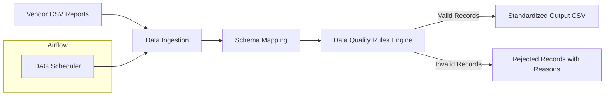

# Data Quality Monitoring & Reporting Automation

## Why this project matters
Many analytical and operational teams rely on daily reports delivered by external vendors.
These files often differ in structure, naming conventions, and data quality, leading to manual validation, delays, and errors.

This project demonstrates how **data quality enforcement, standardization, and reporting automation** can be implemented in a scalable, production-ready way using Python and Apache Airflow.

---

## Project Overview
The solution ingests multiple CSV reports delivered by different teams/vendors, validates them against a shared data quality standard, automatically fixes what can be standardized, and produces:
- a clean, standardized output dataset ready for downstream processing
- a rejected records report explaining exactly what must be fixed by the vendor
  
The pipeline is fully automated and schedulable via Airflow.

---

## Business Problem
- Multiple teams receive reports from different vendors
- Each vendor uses:
  - different column names
  - different date formats
  - inconsistent currency notation
- Reports must:
  - meet strict data quality rules
  - be free of duplicates and nulls
  - conform to a defined schema and column order
- Manual validation is time-consuming and error-prone

## Solution

### Key Capabilities
- Schema standardization via configurable mappings
- Automatic data quality validation
- Clear separation of fixable issues vs vendor-required fixes
- Deterministic, repeatable processing
- Fully automated scheduling with Airflow

### Workflow


## Architecture Overview


## Repository Structure
```
data-quality-monitoring/
├── dags/
│   └── data_quality_dag.py
├── jobs/
│   └── data_quality.py
├── configs/
│   └── dq_rules.yaml
├── data/
│   ├── inputs/
│   │   ├── team_a_vendor_x.csv
│   └── outputs/
│       ├── clean_report.csv
│       └── rejected_records.csv
├── screenshots/
│   ├── airflow_dag.png
│   ├── output_preview.png
│   └── rejected_records.png
├── requirements.txt
└── README.md

```

## Running Locally
- pip install -r requirements.txt
- python jobs/data_quality.py
- By default, the pipeline runs in local mode and creates mock SQLite databases for development and testing.

# Airflow Execution
The DAG dq_monitoring_dag runs on a scheduled basis
Each run:
- ingests new vendor reports
- applies schema mapping and quality checks
- generates output and rejected records
  
# Output
### Standardized Output
- Unified schema
- Consistent column order
- Clean, validated data
- Ready for analytics or further ETL
[sample]

### Rejected Records
- Invalid rows are **not silently dropped**
- Instead, they are written to a dedicated file with full traceability:
  - original row number from the input file
  - vendor identifier
  - human-readable rejection reason
    


# Outcome
- Automated validation of vendor reports
- RReduced manual reporting effort by approximately 1–1.5 hours per day per team
- ~90% reduction in human errors
- ~30–40% faster downstream processing
- Clear feedback loop for vendors
- Reusable pattern for enterprise data quality enforcement

# Design Decisions Worth Noticing
- YAML-driven configuration - business rules and mappings are externalized from code
- Separation of concerns - validation, mapping, and orchestration are cleanly separated
- Fail-safe design - invalid data is captured and explained, never silently ignored
  
# Author
Adrianna Beblowska


