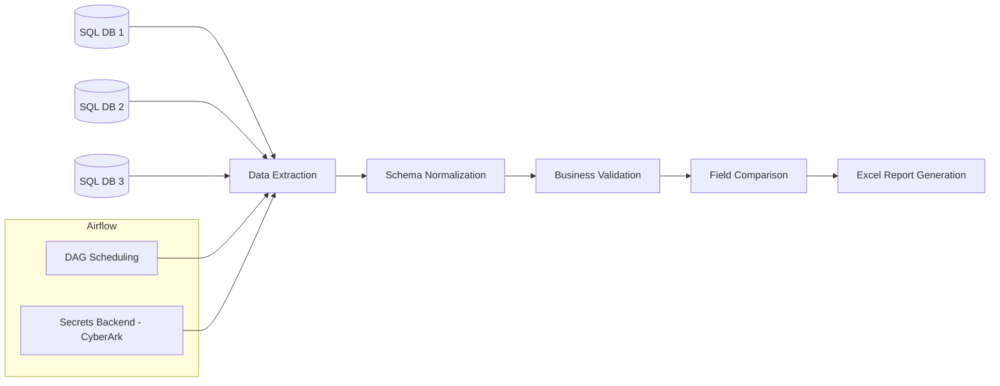

# Report Consolidation Pipeline

## Why this project matters
In many organizations, operational and financial reports are still manually consolidated from multiple source systems with inconsistent schemas.  
This leads to repetitive work, high error rates, and limited scalability.

This project demonstrates how to design a **repeatable, environment-aware, and cross-team safe data consolidation pipeline** that replaces manual Excel-based workflows with an automated, auditable process.

---

## Project Overview
The pipeline consolidates daily reports coming from **three independent SQL databases**, each with a different schema but overlapping business data.

The workflow:
- extracts data from multiple sources,
- normalizes and compares key business attributes,
- validates time-sensitive fields,
- generates a **business-ready Excel report** with conditional formatting and validation rules.

The solution is designed to be:
- **Repeatable**
- **Environment-aware**
- **Cross-team safe**
- **Easily scalable**

---

## Business Problem
- Data originates from **3 separate SQL databases**  
- Column names differ across systems  
- Reports must be **consolidated daily**  
- Data requires **validation** (e.g., expiry dates within 14 days)  
- Output must be **appended and formatted**  
- Manual processing costs ~1–2h per day and is **error-prone**

## Solution

### Core Technologies
- **Python** (Pandas, openpyxl)
- **SQLite** (mocked data sources for local execution)
- **Apache Airflow** (orchestration)
- **Airflow Secrets Backend** (CyberArk-compatible)
- **Excel** with conditional formatting and data validation

### Workflow
1. Extract data from three SQL sources  
2. Normalize schemas  
3. Compare critical business fields (currency mismatch detection)  
4. Validate expiry dates  
5. Generate formatted Excel report  
6. Orchestrate daily execution with Airflow  

## Architecture Overview


## Repository Structure
```
excel-report-consolidation/
├── dags/
│ └── files_consolidation_dag.py
├── jobs/
│ └── files_consolidation.py
├── data/
│ └── sample_outputs/
├── requirements.txt
└── README.md
```

## Running Locally
pip install -r requirements.txt
python jobs/files_consolidation.py
By default, the pipeline runs in local mode and creates mock SQLite databases for development and testing.

# Airflow Execution
- The DAG report_comparison runs daily.
- Secrets are retrieved via Airflow Connections (excel_report_db) using a Secrets Backend (e.g., CyberArk).

# Environment Awareness
- The pipeline behavior is controlled by the ENV variable:
- ENV	Behavior
  local	    -->    Creates mock databases  || 
  dev/prod	-->    Uses existing data sources

# Output
- Daily Excel report: report_YYYYMMDD.xlsx
- Conditional formatting for:
  - Records requiring attention
  - Currency mismatches
- Data validation dropdown for manual review

# Outcome
- Automated cross-team reporting
- Reduced manual work by ~1–2 hours per day
- Near-zero human error
- Scalable and reusable ETL pattern

# Design Decisions Worth Noticing
- Business logic separated from orchestration (DAG vs jobs)
- Schema normalization handled explicitly in Pandas
- Environment-driven behavior without code duplication
- Excel treated as a delivery layer, not a processing layer

# Author
Adrianna Beblowska


